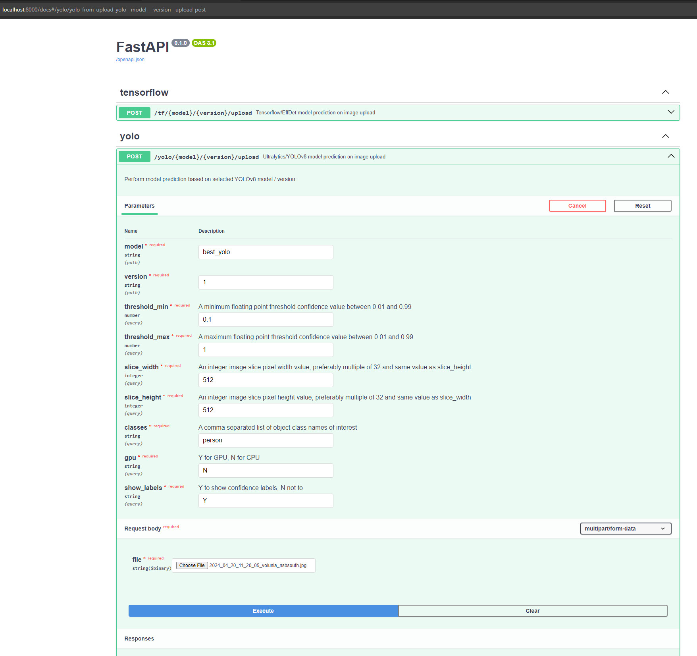

# YOLO Detection

Pre-trained ML models to detect COCO object(best_yolo),seals(best_seal) in images, and APIs to use the models.


## Local setup

It is recommended to create a new Python virtual environment using `conda`, or
its faster alternative, `micromamba`.

`conda` environment creation and activation:

```shell
conda env create -f environment.yml
conda activate webcoos_yolo_detection
```

`micromamba` environment creation and activation:

```shell
micromamba create -f environment.yml
micromamba activate webcoos_yolo_detection
```

## FastAPI Serving

The models can be served using a FastAPI server. The server allows the POSTing of image URLs and raw image (file uploads). The model to use is supplied as URL path parameters.

```shell
POST /{model_name}/{model_version}/upload - Image file upload endpoint
```

The server can be started with

```shell
uvicorn api:app
```

The server can be tested with the `test_api.py` file. It will save images to the `output` folder based on the `model` and `version` requested.

```shell
python ./test/test_api.py
```

The FastAPI server can also be served using Docker:

```shell
docker build -t yolo_det_api .
docker run --gpus all --rm --name yolo_detector -v $(pwd)/outputs/docker:/outputs -p 8000:8000 yolo_det_api
```

And then tested the same as running it outside of Docker

```shell
python ./test/test_api.py
```


## Tensorflow Serving

The models can be served with Tensorflow Serving:

```shell
# Location of demo models
export MODEL_NAME="yolo_detector"

# Start TensorFlow Serving container and open the REST API port
docker run -t --rm -p 8501:8501 \
    -v "$(pwd)/${MODEL_NAME}:/models/${MODEL_NAME}" \
    -e MODEL_NAME=${MODEL_NAME} \
    tensorflow/serving
```

The HTTP endpoint can then be used to pass in JSON image data and write out results to files. See the `test_tf_serving.py` file for an example.

## Stream Processing

The model can also be applied to a live stream using one of the `test/stream_*.py` files.

Run model version 2

```shell
python ./test/stream_effdet2.py
```

Run model version 3

```shell
python ./test/stream_effdet3.py
```
## SAHI: Slicing Aided Hyper Inferencebased examples

Processing a large image as a set of smaller images(slices) to improve object detection performance with small objects in large images. Trade-off between increased detections with increased number of sub-image detection passes.

https://www.ridgerun.ai/post/improving-detection-performance-with-sahi-and-tiled-predictions

https://github.com/obss/sahi

Persons on the beach, good contrast/silhouettes, a few false positives and persons towards the horizon are only a few pixels tall/wide and not able to detect by lowering confidence or slice size without too many additional false positives

confidence=0.1,slice width/height=512,count=43, COCO dataset


Birds on a boardwalk, perhaps poor contrast(lighting,time of day) with birds in upper left causing missed counts, false positives on shadows could be corrected with separate 'shadow' class trained

confidence=0.1,slice width/height=512,count=36, COCO dataset


Seals on the beach, 8 detections and 1 false positive in the water, maybe more training images needed?

confidence=0.1,slice width/height=512


Previous single pass processing with 2 detections


